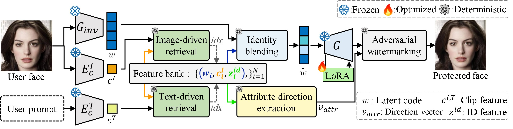
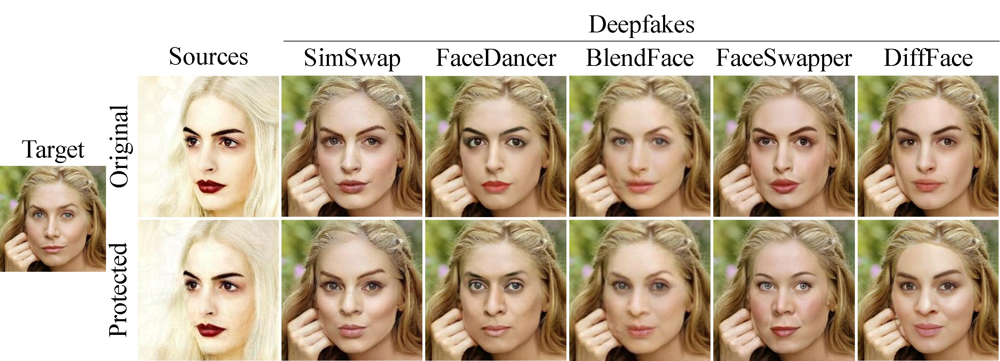

# DeepProtect: Proactive Face-Swapping Defense Using Identity Blending and Attribute Distortion

This directory is an independent, runnable implementation of:

> Eungi Lee, Seung-hyeok Back, Hyung-Il Kim, and Seok Bong Yoo, “DeepProtect: Proactive Face-Swapping Defense using Identity Blending and Attribute Distortion.” **IEEE/CVF Conference on Computer Vision and Pattern Recognition (CVPR), 2026.**


**Publication status:** the paper is **accepted to CVPR 2026** and received the **CVPR Compute Gold Star**.


<p align="center">
  
</p>

<p align="center">
  <!-- <b>Overview of the proposed DeepProtect framework.</b> -->
</p>


<p align="center">
  
</p>

<p align="center">
  <!-- <b>Qualitative results of DeepProtect.</b> -->
</p>

## Abstract
Face-swapping deepfakes allow realistic identity transfer, which can serve creative purposes but increases the risk of identity abuse. A proactive defense aims to prevent deepfake creation by obstructing identity feature extraction from input images,  essential for identity-driven face-swapping. Existing proactive defense approaches aim to protect faces by hindering accurate identity feature extraction, but tend to introduce visible artifacts and fail to degrade the visual quality of the face-swapping deepfakes. We propose a proactive face-swapping defense using identity blending and attribute distortion (DeepProtect) that integrates global identity fusion in the latent space and local prompt-driven adversarial watermarking to address these problems. We dilute distinct identity representations by channel-wise blending of multiple identities in the latent space and optimizing the generator for visual consistency. The proposed approach distorts facial components in the identity space, directly influencing how faces are reconstructed in deepfakes. Our approach applies semantic directions derived from user-provided text prompts to embed imperceptible adversarial watermarks that selectively distort facial attributes, affecting the visual fidelity of deepfake results. The proposed method hinders face-swapping deepfakes while preserving the perceptual quality of the protected images, offering a robust and practical solution for facial privacy protection. The experimental results reveal that DeepProtect effectively defends against face-swapping deepfakes while preserving visual consistency.

## What is implemented

DeepProtect has two sequential components:

1. **Identity blending in StyleGAN2 W+.** e4e encodes an aligned face into an 18×512 W+ code. FaRL/CLIP retrieves visually similar samples from a VGGFace2-HQ feature bank. For StyleGAN style indices 2–6 (the paper’s layers 3–7), each style vector is substituted with the most cosine-similar candidate style vector. The other style vectors are unchanged.
2. **Generator optimization.** Only the middle StyleGAN blocks (`b16` and `b32`) are adapted through rank-8 LoRA affine updates. The objective is exactly the paper’s reconstruction objective, `L2 + LPIPS + λ_id-lock L_id-lock`, with learning rate `3e-4`, `λ_id-lock=0.1`, and an early-stop LPIPS threshold of `0.06` or a maximum of 450 steps.
3. **Prompt-driven attribute distortion.** FaRL text features rank the bank for a user prompt such as `nose`, `eyebrows`, `eyes`, or `lips`. The top and bottom 30 identity features are separated with order-aware LDA. The resulting identity-space direction is used to set `v_target = -sign(z_id·v_attr)v_attr`, and a sign-gradient watermark is projected into the pixel-space `ℓ∞` ball.

The default watermark budget is `ε=0.02` in `[0,1]` image space, as reported in the paper. The default implementation uses 44 sign-gradient steps with step size `1/255` and no momentum; the paper’s equations specify the sign update and projection, while the CLI exposes these numerical choices for reproducibility.

## Repository layout

```text
DeepProtect_real/
├── deep_protect/
│   ├── blending.py             # W+ retrieval and identity blending, Eqs. (1)–(2)
│   ├── feature_bank.py         # HDF5/NPZ bank I/O
│   ├── oal_da.py               # order-aware LDA, Eqs. (7)–(8)
│   ├── optimization.py         # LoRA generator optimization, Eq. (4)
│   ├── pipeline.py             # complete combined/attribute-only pipeline
│   ├── watermark.py             # FaRL direction + adversarial watermark, Eqs. (9)–(11)
│   └── models/                 # StyleGAN, e4e, ArcFace, FaRL, and LoRA loaders
├── scripts/
│   ├── align_faces.py
│   ├── build_feature_bank.py
│   ├── inference.py
│   └── train.py
├── networks.py                 # bundled StyleGAN2-ADA network implementation
├── torch_utils/                # bundled StyleGAN2-ADA runtime modules
├── models/e4e/                 # bundled e4e/pSp runtime modules
└── requirements.txt
```

## Environment

Linux, Python 3.10 or newer, and an NVIDIA GPU with a CUDA-compatible PyTorch build are recommended. CPU execution is supported for smoke tests but is not practical for 1024×1024 StyleGAN/e4e optimization.

```bash
cd /var/tmp/jnuadmin_storage/shback/z_paper/DeepProtect/DeepProtect_real
python3 -m venv .venv
source .venv/bin/activate

# Install the PyTorch wheel matching the local CUDA driver first if needed.
pip install --upgrade pip
pip install -r requirements.txt
```

The FaRL checkpoint must be loadable through the OpenAI-CLIP-compatible `clip` API. If a particular FaRL release supplies its own CLIP package, install that package instead of the final `git+https://github.com/openai/CLIP.git` line.

## Pretrained models

Download the following files into any location. The commands below take explicit paths, so the files do not need to be copied into the repository.

| File | Use | Source / expected format |
|---|---|---|
| `ffhq.pkl` | official StyleGAN2-ADA FFHQ generator, 1024×1024 | [NVIDIA StyleGAN2-ADA FFHQ pickle](https://nvlabs-fi-cdn.nvidia.com/stylegan2-ada-pytorch/pretrained/ffhq.pkl) |
| `e4e_ffhq_encode.pt` | e4e encoder and its StyleGAN decoder | e4e FFHQ encoder checkpoint; it must contain `opts` and the encoder/decoder state dicts |
| `arcface_checkpoint.tar` or `model_ir_se50.pth` | frozen ArcFace identity encoder | ArcFace IR/IR-SE-50 checkpoint; a serialized `torch.nn.Module` or a state dict is accepted |
| `FaRL-Base-Patch16-LAIONFace20M-ep64.pth` | FaRL image/text embedding model | FaRL checkpoint compatible with `clip.load("ViT-B/16")` |
| `shape_predictor_68_face_landmarks.dat` | optional raw-image alignment | dlib 68-point landmark predictor |

The e4e, ArcFace, and FaRL files are not redistributed here. Use the checkpoint links/releases supplied by their authors and comply with their licenses. `--farl` may also point to an already initialized CLIP-compatible checkpoint; if it is absent, the script uses the base model loaded by `clip.load`.

## Data and feature bank

The paper evaluates on **CelebA-HQ** and **VGGFace2-HQ**:

- CelebA-HQ is used for cross-validation and quantitative source/deepfake evaluation.
- VGGFace2-HQ supplies the fixed retrieval bank: one representative image for each of **4,605 distinct identities**, with a W+ latent, a FaRL image feature, and an ArcFace identity feature per entry. The complete dataset is described in the paper as 9,630 identities and about 1.3M face images.
- Quantitative experiments use 1,000 source images and 10,000 generated images with random target identities. The protected sources are evaluated with SimSwap, FaceDancer, BlendFace, FaceSwapper, and DiffFace.
- None of CelebA-HQ or VGGFace2-HQ is used to train StyleGAN2, e4e, ArcFace, or FaRL in this implementation. The VGGFace2-HQ bank is fixed and does not need to be rebuilt for each source dataset.

Input images must be RGB, tightly aligned to the FFHQ convention, and nominally 1024×1024. Align raw images with the supplied dlib utility:

```bash
python scripts/align_faces.py \
  --input-dir /data/raw_faces \
  --output-dir /data/aligned_faces \
  --shape-predictor /models/shape_predictor_68_face_landmarks.dat
```

Build the bank by selecting one deterministic image per identity directory. For the paper setting, `--max-identities` remains 4605:

```bash
python scripts/build_feature_bank.py \
  --images /data/VGGFace2-HQ/aligned \
  --output /data/banks/vggface2_hq_4605.h5 \
  --e4e /models/e4e_ffhq_encode.pt \
  --arcface /models/arcface_checkpoint.tar \
  --farl /models/FaRL-Base-Patch16-LAIONFace20M-ep64.pth \
  --max-identities 4605 \
  --batch-size 8
```

The generated bank contains:

```text
latents         [N, 18, 512]
clip_features   [N, D]       # normalized FaRL image embeddings
id_features     [N, 512]    # normalized ArcFace embeddings
names           [N]          # source paths, optional
```

Both `.h5`/`.hdf5` and `.npz` are supported. Existing banks from the earlier code are also accepted when they contain `gallery_e4e`, `gallery_clip`, and `gallery_f` datasets.

## Inference

The default `combined` mode performs the complete paper pipeline: e4e encoding, identity blending, partial LoRA generator optimization, then prompt-driven attribute distortion.

```bash
python scripts/inference.py \
  --image /data/aligned_faces/person_0001.jpg \
  --output-dir outputs/person_0001 \
  --feature-bank /data/banks/vggface2_hq_4605.h5 \
  --stylegan /models/ffhq.pkl \
  --e4e /models/e4e_ffhq_encode.pt \
  --arcface /models/arcface_checkpoint.tar \
  --farl /models/FaRL-Base-Patch16-LAIONFace20M-ep64.pth \
  --prompt nose
```

Useful controlled variants:

```bash
# Attribute-only ablation: skip identity blending and generator tuning.
python scripts/inference.py ... --mode attribute --prompt eyebrows

# Inspect the blended generator output without the 450-step optimization.
python scripts/inference.py ... --no-generator-optimization
```

The output directory contains `source.png`, `identity_blended.png`, `generator_optimized.png` (combined mode), `protected.png`, `latent_original.pt`, `latent_blended.pt`, `lora_state.pt`, `watermark.pt`, `attribute_direction.pt`, candidate indices, and `metadata.json`. `protected.png` is the final image to publish or pass to a face-swapping system.

## Training / dataset-scale processing

DeepProtect does not train a new universal network. Its “training” is the per-source partial generator optimization described in Section 3.3 of the paper. To run that optimization over a directory:

```bash
python scripts/train.py \
  --input-dir /data/CelebA-HQ/aligned \
  --output-dir outputs/celeba_hq \
  --feature-bank /data/banks/vggface2_hq_4605.h5 \
  --stylegan /models/ffhq.pkl \
  --e4e /models/e4e_ffhq_encode.pt \
  --arcface /models/arcface_checkpoint.tar \
  --farl /models/FaRL-Base-Patch16-LAIONFace20M-ep64.pth \
  --prompt nose \
  --max-images 1000
```

Each image gets an independent LoRA state and metadata record. The base FFHQ StyleGAN remains frozen and is reloaded once by the pipeline; only the selected affine LoRA parameters are optimized. Use `--mode attribute` for the paper’s attribute-only ablation, although the loader still accepts the full model arguments for a uniform command line.

Important defaults from the paper are exposed as CLI/config values: `tau=0.75`, `m=30`, `lambda_R=1`, style indices `2:7`, LoRA rank `8`, learning rate `3e-4`, identity-lock weight `0.1`, maximum generator steps `450`, LPIPS threshold `0.06`, watermark `epsilon=0.02`, and prompt `nose`.

## Evaluation protocol

For source fidelity, compare the original aligned source and `protected.png` with PSNR and SSIM; compute ISM with the same ArcFace encoder. For defense, run the original and protected source through the same face-swapping model and compare the resulting deepfakes with PSNR/SSIM and DSR. The paper also reports PDS, the SSIM difference between source/protected pairs and their corresponding deepfakes. Use identical source images, target identities, preprocessing, and random seeds for both conditions. This repository intentionally does not bundle third-party face-swapping models or their datasets.

The paper reports the following headline combined-method results: on CelebA-HQ, source PSNR/SSIM/ISM of 32.02/0.902/0.201; on VGGFace2-HQ, 31.57/0.904/0.198. With SimSwap, the reported DSR is 94.8% on CelebA-HQ and 95.0% on VGGFace2-HQ. These are paper results, not a claim that this checkout has run the full benchmark.

## Reproducibility and limitations

- The method is designed for aligned single-face images and currently processes one source at a time during protection.
- The output quality depends on the exact FFHQ StyleGAN2-ADA, e4e, ArcFace, and FaRL checkpoint versions. Checkpoint provenance should be recorded in `metadata.json` by the experiment manager.
- Feature-bank construction is expensive because each bank identity is encoded with e4e, FaRL, and ArcFace. Build it once and reuse it.
- Generator optimization is differentiable and uses a frozen ArcFace surrogate; the face-swapping model itself remains black-box during protection.
- The `torch_utils/`, `networks.py`, and `models/e4e/` files are included only so this folder can run independently. The old `DeepProtect_CVPR26-main` folder is not modified.

## Citation

```bibtex
@inproceedings{lee2026deepprotect,
  title     = {DeepProtect: Proactive Face-Swapping Defense using Identity Blending and Attribute Distortion},
  author    = {Lee, Eungi and Back, Seung-hyeok and Kim, Hyung-Il and Yoo, Seok Bong},
  booktitle = {Proceedings of the IEEE/CVF Conference on Computer Vision and Pattern Recognition},
  year      = {2026},
  note      = {Accepted to CVPR 2026; proceedings version pending publication}
}
```
